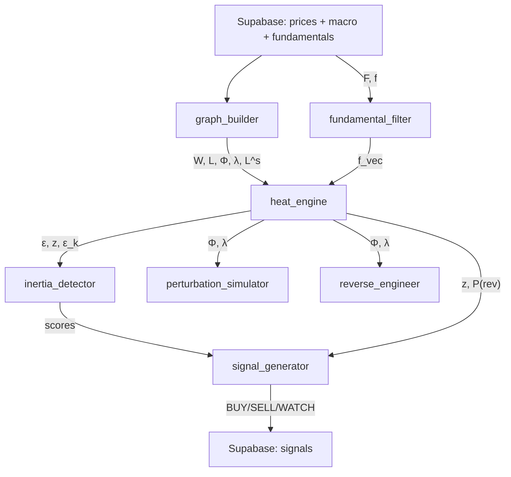
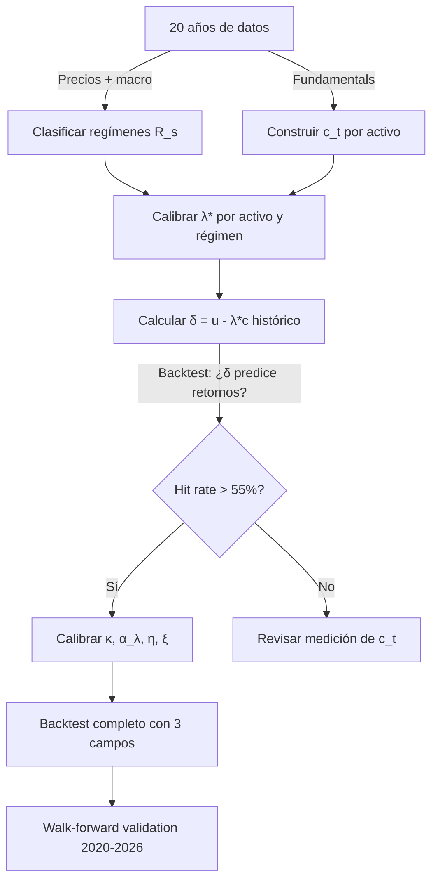

# Fundamento Matemático — GlobalMarketAnalyzer

## 1. El Modelo: Ornstein-Uhlenbeck sobre Grafo Fraccional

### 1.1 Variable de estado

Definimos la **temperatura** del activo $i$ como el retorno real acumulado:

$$u_i(t) = \sum_{\tau=1}^{t} \left[ r_i(\tau) - \pi(\tau) \right]$$

donde $r_i = \ln(P_i(t)/P_i(t-1))$ es el log-retorno y $\pi$ la inflación diaria (proxy: yield 2y / 252).

**¿Por qué "temperatura"?** Es una analogía termodinámica: capital acumulado ≡ energía térmica. Un activo "caliente" ha acumulado retornos por encima de la inflación; uno "frío" ha destruido valor real.

### 1.2 La ecuación O-U en grafo

El proceso estocástico que gobierna la dinámica es:

$$du = -\alpha \cdot L^s \cdot (u - u_{eq}) \cdot dt + f \cdot dt + \Sigma \cdot dW$$

| Término | Significado | Implementación |
|---|---|---|
| $\alpha$ | Tasa de reversión a la media | Calibrado por modo espectral |
| $L^s$ | Laplaciano fraccional del grafo | `graph_builder.fractional_laplacian` |
| $u_{eq}$ | Equilibrio (atraído por fundamentales) | `fundamental_filter.get_source_vector` |
| $f$ | Fuente/sumidero fundamental | $\gamma \cdot \tanh(F/F_0)$ |
| $\Sigma \cdot dW$ | Ruido estocástico | No modelado explícitamente (es el residuo) |

### 1.3 Solución analítica en espacio espectral

Descomponemos en los eigenvectores $\Phi$ del Laplaciano $L$:

$$L = \Phi \cdot \Lambda \cdot \Phi^T, \quad \Lambda = \text{diag}(\lambda_0, \lambda_1, ..., \lambda_{N-1})$$

Proyectamos al espacio espectral: $u_k = \Phi^T u$, $f_k = \Phi^T f$

En cada modo $k$ la solución es un O-U **escalar** independiente:

$$u_k(t+1) = u_k(t) \cdot e^{-\mu_k} + \frac{f_k}{\mu_k}(1 - e^{-\mu_k})$$

donde $\mu_k = \alpha_k \cdot \lambda_k^s$ es la **tasa de reversión del modo $k$**.

**Interpretación física:**
- $\lambda_k$ pequeño (modo lento) → $\mu_k$ pequeño → el modo persiste largo tiempo → **macro trend**
- $\lambda_k$ grande (modo rápido) → $\mu_k$ grande → equilibra rápido → **ruido/idiosincrático**
- $s < 1$ → fraccional → los modos lentos decaen más lento que en difusión normal → **memoria larga**

---

## 2. El Grafo: Multi-Capa con Cross-Lag

### 2.1 Construcción del grafo

Para cada par $(i,j)$ y cada lag $\ell \in [-15, +15]$ días:

$$\rho_{ij}(\ell) = \text{corr}(r_i(t), r_j(t+\ell))$$

Se elige el lag óptimo: $\ell^*_{ij} = \arg\max_\ell |\rho_{ij}(\ell)|$

La arista se crea si: $|\rho_{ij}(\ell^*)| > \theta$ (threshold = 0.25)

$$W_{ij} = \rho_{ij}(\ell^*_{ij}) \quad \text{si } |\rho| > \theta, \text{ else } 0$$

**Signo preservado**: $W_{ij} > 0$ = co-movimiento, $W_{ij} < 0$ = anti-correlación.

### 2.2 Multi-escala temporal

Se calcula $W$ para 3 ventanas: 20d (intraday contagion), 60d (sector rotation), 120d (macro cycles).

$$W_{eff} = w_1 \cdot W_{20d} + w_2 \cdot W_{60d} + w_3 \cdot W_{120d}$$

Los pesos $w_i$ son adaptativos: si VIX alto → más peso a escala corta (contagio rápido).

### 2.3 Vecinos de 2º y 3er orden

$$W^{(2)} = W \cdot W, \quad W^{(3)} = W^{(2)} \cdot W$$

> [!CAUTION]
> **Bug actual**: el código usa $|W| \cdot |W|$ (pierde signo) en vez de $W \cdot W$. Pendiente de fix en Fase 1.

**Interpretación**: Si cobre (FCX) → industriales (CAT) y CAT → materiales (XLB), entonces FCX ↝ XLB es un path de 2º orden. $W^{(2)}$ captura esto.

$$W_{total} = W + \beta_2 \cdot \bar{W}^{(2)} + \beta_3 \cdot \bar{W}^{(3)}$$

con $\beta_2 = 0.15$, $\beta_3 = 0.05$, y $\bar{W}^{(k)} = W^{(k)} / \max(W^{(k)})$ (normalizado).

### 2.4 Laplaciano con signo

$$L = D - W, \quad D_{ii} = \sum_j |W_{ij}|$$

El Laplaciano **con signo** difiere del clásico: los eigenvalores no son necesariamente ≥0 si hay suficientes aristas negativas. `np.maximum(λ, 0)` fuerza estabilidad.

### 2.5 Laplaciano fraccional

$$L^s = \Phi \cdot \Lambda^s \cdot \Phi^T, \quad \Lambda^s = \text{diag}(\lambda_0^s, ..., \lambda_{N-1}^s)$$

El parámetro $s \in (0, 1]$ controla la **no-localidad**:

$$s(t) = s_0 - c_1 \cdot \text{VIX}_{norm}(t) - c_2 \cdot \text{spread}(t) - c_3 \cdot \text{credit}(t)$$

| $s$ | Régimen | Significado |
|---|---|---|
| $s \approx 1$ | Calma | Difusión local, correlaciones normales |
| $s \approx 0.5$ | Stress | No-local, contagio a distancia (Lévy flights) |
| $s \approx 0.2$ | Crisis | Todo correlacionado, un shock afecta a todos |

---

## 3. El Source Term: Fundamentales

### 3.1 Score fundamental

$$F_i = w_1 \cdot \text{FCF\_yield}_i + w_2 \cdot (\text{ROIC}_i - \text{WACC}) + w_3 \cdot (g_i - \pi) + w_4 \cdot Q_i$$

| Componente | Peso | Qué mide |
|---|---|---|
| FCF yield | 0.35 | Cash libre / market cap |
| ROIC excess | 0.25 | Retorno sobre capital - coste |
| Growth real | 0.25 | Crecimiento de revenue - inflación |
| Quality | 0.15 | Solvencia (debt/equity, current ratio) |

### 3.2 Source term

$$f_i = \gamma \cdot \tanh(F_i / F_0)$$

$F_0 = \text{mediana}(|F|)$ normaliza. $\gamma = 0.01$ es la tasa diaria máxima.

- $F \gg 0 \Rightarrow f \approx +\gamma$ → fuente de calor (crea valor)
- $F \ll 0 \Rightarrow f \approx -\gamma$ → sumidero (destruye valor)
- ETFs, commodities → $f = 0$ (neutros)

---

## 4. Residuos y Z-Scores

### 4.1 Residuo

$$\varepsilon_i(t) = u_i^{real}(t) - u_i^{pred}(t)$$

En espacio espectral: $\varepsilon_k(t) = u_k^{real}(t) - u_k^{pred}(t)$

### 4.2 Z-score rolling

$$z_i(t) = \frac{\varepsilon_i(t)}{\sigma_{\varepsilon_i}^{(20)}(t)}$$

donde $\sigma^{(20)}$ es desviación estándar rolling de 20 días.

**Interpretación**: $z > 0$ → activo "caliente" (por encima del equilibrio O-U), $z < 0$ → "frío".

---

## 5. Probabilidades Analíticas

Para el proceso O-U, la distribución condicional es Gaussiana:

$$u_i(t+h) \sim \mathcal{N}\left(\varepsilon_i(t) \cdot e^{-\mu_{eff} \cdot h}, \quad \frac{\sigma_i^2}{2\mu_{eff}}(1 - e^{-2\mu_{eff} \cdot h})\right)$$

donde:

$$\mu_{eff,i} = \sum_k \phi_{ki}^2 \cdot \mu_k = \sum_k \phi_{ki}^2 \cdot \alpha_k \cdot \lambda_k^s$$

**Probabilidad de reversión**: $P(\text{rev}) = P(|\varepsilon(t+h)| < |\varepsilon(t)|)$

**Half-life**: $t_{1/2} = \ln(2) / \mu_{eff}$

---

## 6. Inercia — 5 Componentes

### 6.1 Espacio de fases $(u_i, \dot{u}_i)$

La trayectoria en el plano posición-velocidad revela:
- **Espiral convergente** → reverting al equilibrio
- **Espiral divergente** → burbuja o tendencia acelerante
- **Ciclo cerrado** → trading range
- Radio $r(t) = \sqrt{u_i^2 + \dot{u}_i^2}$, y $dr/dt$ clasifica el estado

### 6.2 Masa efectiva

$$M_{eff,i} = \frac{1}{\sigma_{vol,i}} \cdot D_{ii} \cdot (1 + |\phi_{Fiedler,i}|)$$

Alta masa → señal más significativa (AAPL z=2 pesa más que un penny stock z=2).

### 6.3 Momento angular espectral

$$L_k(t) = u_k(t) \cdot \dot{u}_k(t)$$

$L_k > 0$ → capital rotando en una dirección. $|dL_k/dt|$ → torque.

### 6.4 Flujo de energía

$$E_k = \frac{1}{2}\left(u_k^2 + \frac{\dot{u}_k^2}{\lambda_k^s}\right), \quad \frac{dE_k}{dt} > 0 \Rightarrow \text{modo } k \text{ gana capital}$$

### 6.5 Histéresis

$$H_i = \frac{\langle|\varepsilon_i| \,|\, r_i > 0\rangle}{\langle|\varepsilon_i| \,|\, r_i < 0\rangle}$$

$H > 1$ → más fácil subir que bajar. $H < 1$ → más fácil bajar.

---

## 7. Ingeniería Inversa — Sismología

Dado un vector de retornos anómalos $r(t_0)$ el día del evento:

### 7.1 Firma espectral

$$\hat{r}_k = \Phi^T \cdot r(t_0), \quad k = 0, ..., N-1$$

### 7.2 Epicentro

$$i^* = \arg\max_i \frac{|r_i(t_0)|}{\sigma_i}$$

### 7.3 Similitud entre eventos

$$\text{sim}(A, B) = \frac{\hat{r}_A \cdot \hat{r}_B}{|\hat{r}_A| \cdot |\hat{r}_B|}$$

(Cosine similarity en espacio espectral.)

---

## 8. Flujo del Pipeline

---

## 9. Advección — Flujos de Capital

### 9.1 Ecuación completa (actual)

$$\frac{\partial u}{\partial t} = -\alpha \cdot L^s \cdot u + v(t) + f(t)$$

El término **v(t)** es la velocidad macro — hacia dónde fluye el capital:

$$v_i(t) = \sum_j \beta_{ij}(t) \cdot \Delta M_j(t) + \text{injection}(t)$$

| Componente | Fórmula | Significado |
|---|---|---|
| $\beta_{ij}$ | Regresión rolling 120d de $r_i$ vs $\Delta M_j$ | Sensibilidad del activo i al macro j |
| $\Delta M_j$ | Z-change 20d de VIX, DXY, yield, copper, oil | Velocidad de cambio macro |
| injection(t) | $\overline{r}(t)$ suavizado (EMA 20d) | Capital neto entrando/saliendo del sistema |

### 9.2 Decontaminación de W

Antes de construir el grafo, se elimina el factor de mercado:

$$r_i^{resid}(t) = r_i(t) - \beta_i^{mkt} \cdot \bar{r}(t)$$

Las correlaciones se calculan sobre $r^{resid}$, capturando relaciones reales (sustitución, cadena de suministro) sin co-movimiento espurio.

### 9.3 Capital NO se conserva

> [!IMPORTANT]
> A diferencia de la ecuación del calor clásica, el mercado financiero es un **sistema abierto**. El capital se crea (QE, earnings, inversión) y se destruye (QT, defaults, quiebras). El modo $k=0$ ($\lambda_0=0$) NO es conservación de capital — es la tendencia neta del sistema.

---

## 10. Modelo de Fluido-Temperatura: $c$ (materia), $\lambda$ (temperatura)

### 10.1 La analogía correcta

| Concepto físico | Concepto financiero | Variable |
|---|---|---|
| **Fluido (materia)** | Capital real | $c_i(t)$ — la sustancia que fluye |
| **Temperatura del fluido** | Múltiplo de valoración | $\lambda_i(t)$ — propiedad transportada por c |
| **Energía observable** | Precio (lo que se ve en el mercado) | $u_i(t) = \lambda_i \cdot c_i$ |
| **Velocidad del fluido** | Dirección de los flujos de capital | $v(t)$ — advección macro |
| **Fuentes/sumideros** | Creación/destrucción de capital real | $g_i(t)$ — earnings, QE, defaults |

El capital ($c$) es la **materia** — se mueve, fluye entre sectores, entra y sale del sistema. Lambda ($\lambda$) es la **temperatura** que viaja CON el capital: cuando el capital sale de tech y va a bonos, lleva consigo las expectativas de valoración.

### 10.2 Ecuaciones del sistema acoplado

#### Ecuación de continuidad del capital (el fluido)
$$\frac{\partial c_i}{\partial t} = - \nabla \cdot (c_i \cdot v_i) - \alpha_c \cdot L \cdot c_i + g_i(t)$$

| Término | Significado |
|---|---|
| $-\nabla \cdot (c \cdot v)$ | **Convección**: el capital fluye por el grafo con velocidad $v$ |
| $-\alpha_c \cdot L \cdot c$ | **Difusión**: el capital se redistribuye hacia equilibrio |
| $g_i(t)$ | **Fuentes/sumideros**: FCF crea capital, defaults lo destruyen, QE lo inyecta |

En el grafo, la divergencia $\nabla \cdot (c \cdot v)$ se discretiza como:
$$[\nabla \cdot (c \cdot v)]_i = \sum_{j \in \mathcal{N}(i)} W_{ij} \cdot (c_j \cdot v_j - c_i \cdot v_i)$$

#### Ecuación de advección-difusión de λ (la temperatura)
$$\frac{\partial \lambda_i}{\partial t} = - v_i \cdot \nabla \lambda_i - \alpha_\lambda \cdot L^s \cdot (\lambda_i - \lambda_{eq}(s)) + \eta \cdot \frac{\Delta c_i}{c_i}$$

| Término | Significado |
|---|---|
| $-v \cdot \nabla \lambda$ | **Advección**: λ es arrastrada POR el flujo de capital |
| $-\alpha_\lambda L^s (\lambda - \lambda_{eq})$ | **Difusión fraccional**: λ se contagia lento entre empresas similares |
| $\eta \cdot \Delta c / c$ | **Shock local**: cuando c salta (earnings surprise), λ reacciona |

En el grafo:
$$[v \cdot \nabla \lambda]_i = \sum_{j \in \mathcal{N}(i)} W_{ij} \cdot v_{ij} \cdot (\lambda_j - \lambda_i)$$

#### Precio observable
$$u_i(t) = \lambda_i(t) \cdot c_i(t)$$

El precio no tiene ecuación propia — es el **producto** de cuánto capital hay × cuánto lo valora el mercado.

### 10.3 Velocidad del fluido $v(t)$

La velocidad del capital es el campo que ya calculamos como macro velocity:

$$v_i(t) = \sum_j \beta_{ij}(t) \cdot \Delta M_j(t) + \text{injection}(t)$$

Pero ahora tiene interpretación física: es la velocidad de flujo del capital en el nodo $i$. Capital flows TO $i$ si $v_i > 0$ y AWAY si $v_i < 0$.

### 10.4 Equilibrio de λ por régimen

$$\lambda_{eq}(s) = \begin{cases}
\lambda_{crisis} \approx 5-8 & \text{si } s < 0.40 \\
\lambda_{stress} \approx 10-15 & \text{si } 0.40 \leq s < 0.65 \\
\lambda_{normal} \approx 18-22 & \text{si } 0.65 \leq s < 0.85 \\
\lambda_{hype} \approx 30-50 & \text{si } s \geq 0.85
\end{cases}$$

Calibrado históricamente: $\lambda_{eq}(R) = \text{median}(\lambda_i)$ para días en régimen $R$.

### 10.5 La señal de trading: mispricing

$$\delta_i(t) = \lambda_i(t) - \lambda_{eq}(s(t))$$

O equivalentemente, usando el reescalado empírico $\lambda^*_i(R)$:

$$\delta_i(t) = \frac{u_i(t)}{c_i(t)} - \lambda^*_i(s(t))$$

- $\delta > 0$: el mercado valora este capital MÁS de lo normal para este régimen → sobrevalorado
- $\delta < 0$: lo valora MENOS → infravalorado
- Cuando el capital FLUYE hacia $i$ ($v_i > 0$) Y $\delta_i < 0$ → señal fuerte de compra: el capital llega a algo infravalorado

### 10.6 Conservación y no-conservación

> [!IMPORTANT]
> El capital $c$ **NO se conserva**: $\sum_i g_i(t) \neq 0$
> - QE: $g > 0$ para todos (inyección sistémica)
> - Defaults: $g_i \ll 0$ para la empresa afectada
> - Earnings: $g_i > 0$ localizado
>
> Lambda $\lambda$ **tampoco se conserva** — el mercado puede decidir colectivamente valorar TODO a múltiplos más altos (expansión de múltiplos) o más bajos (contracción).
>
> Lo que se conserva a corto plazo es el **dinero total**: cuando vendes AAPL y compras XOM, el flujo es $c_{AAPL} \to c_{XOM}$ sin creación neta. Pero a largo plazo, earnings crean y defaults destruyen.

---

## 11. Parámetros a Calibrar Históricamente

### 11.1 Lista completa de parámetros

| Parámetro | Ecuación | Calibración | Datos necesarios |
|---|---|---|---|
| $\alpha$ | Difusión de u | OOS minimization (ya implementado) | Precios 20y |
| $s(t)$ | Fracionalidad del Laplaciano | Z-scores de macro (implementado) | VIX, DXY, spreads |
| $\kappa$ | Acoplamiento u↔λc | Regresión $\Delta u$ vs $(\lambda c - u)$ | Fundamentals + precios |
| $\lambda^*_i(R)$ | Múltiplo por activo y régimen | OLS condicionado (Sec 10.5) | 20y precios + fundamentals |
| $\alpha_\lambda$ | Difusión de múltiplos | Autocorrelación de PE ratios sectoriales | 20y PE ratios |
| $\eta$ | Sensibilidad de λ a earnings | Event study en earnings surprises | Earnings calendar |
| $\xi$ | Reflexividad (momentum→λ) | Regresión $\Delta \lambda$ vs $\nabla u$ | 20y precios |
| $\beta_{ij}$ | Sensibilidad macro | Rolling regression 120d (implementado) | 20y precios + macro |
| $\tilde{W}$ | Grafo dirigido para λ | Causalidad de Granger + capitalización | 20y retornos |

### 11.2 Estrategia de calibración

**Walk-forward**: calibrar en 2005-2019, testear en 2020-2026 (out-of-sample incluye COVID, AI hype, rate hikes).

### 11.3 Riesgo de sobreajuste

Con 9+ parámetros y 20 años de datos:
- **Grados de libertad**: ~5,000 días × 100 activos = 500,000 observaciones → suficiente
- **Pero**: los regímenes son pocos (3-4 crisis, 2-3 hype periods) → los parámetros condicionados por régimen tienen N pequeño
- **Mitigación**: regularización (ya en α), cross-validation temporal, penalizar complejidad (BIC/AIC)

---

## 12. Roadmap de Implementación

| Prioridad | Tarea | Dependencia | Estado |
|---|---|---|---|
| 🔴 1 | Cargar 20y de datos (precios + macro + fundamentals) | Ninguna | En progreso |
| � 2 | Calibrar $\lambda^*(R)$ por régimen con OLS | Datos 20y | Pendiente |
| 🔴 3 | Backtest δ vs retornos futuros (5d, 20d) | λ calibrado | Pendiente |
| 🟡 4 | Implementar $\kappa$ acoplamiento en heat_engine | Backtest δ positivo | Pendiente |
| 🟡 5 | Grafo dirigido $\tilde{W}$ con Granger causality | Datos 20y | Pendiente |
| 🟡 6 | Calibrar $\alpha_\lambda$, $\eta$, $\xi$ | Grafo dirigido | Pendiente |
| 🟢 7 | Walk-forward 2020-2026 | Todo calibrado | Pendiente |
| 🟢 8 | Eigenvalores complejos → ciclos sectoriales | Grafo dirigido | Investigación |

