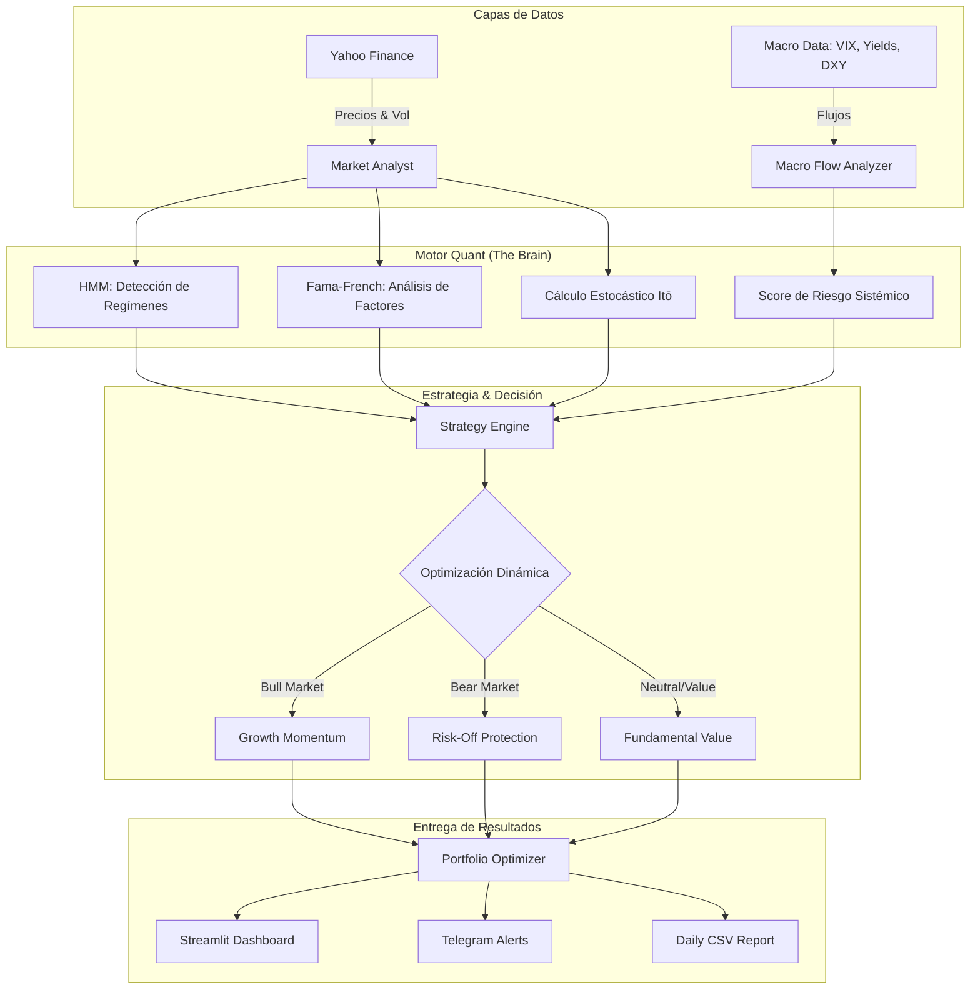

# 🧠 Global Market Analyzer (Unified Intelligence System)

> **Tu terminal de inteligencia financiera cuantitativa, autónoma y localizada en Euros (€).**

El **Global Market Analyzer** es una infraestructura de grado institucional comercial diseñada para inversores que buscan decisiones basadas en datos, no en emociones. Este sistema no solo mira precios; analiza la estructura latente del mercado, descompone el alfa de los activos y monitoriza los flujos macroeconómicos globales en tiempo real.

---

## 🏛️ Arquitectura del Sistema: "El Cerebro Unificado"

El sistema opera bajo un modelo de orquestación multicapa donde cada módulo se especializa en una dimensión del mercado.



---

## 🔬 Inmersión Técnica: Cuantificación Avanzada

### 1. Detección de Regímenes via HMM (Hidden Markov Models)
A diferencia de los promedios móviles tradicionales que tienen retraso, el **HMM** detecta cambios en la distribución de probabilidad de los retornos.
- **Lógica**: Identifica "estados ocultos" basándose en la volatilidad y la deriva (drift).
- **Impacto**: Si el sistema detecta una transición al estado *Bear*, recorta automáticamente la exposición a activos de alto riesgo (Tech, Crypto) e incrementa el peso en activos defensivos, incluso si el precio aún no ha caído significativamente.

### 2. Descomposición de Alfa (Fama-French 3-Factor Model)
No todas las subidas son iguales. Utilizamos regresión multineal para filtrar el ruido del mercado:
- **Market Beta**: ¿Sube porque el mercado sube?
- **Size & Value Factors**: ¿Sube por su capitalización o valoración relativa?
- **Alpha**: El residuo puro. El valor real generado por la gestión o la ventaja competitiva de la empresa. **Solo buscamos Alfa positivo persistente.**

### 3. Dinámica Estocástica de Itō (GBM)
Modelamos el precio como un proceso de **Movimiento Browniano Geométrico**:
$$dS_t = \mu S_t dt + \sigma S_t dW_t$$
Esto nos permite generar "Túneles de Probabilidad" a 30 días, estableciendo niveles de soporte y resistencia basados en la desviación estándar logarítmica, lo que resulta en objetivos de precio mucho más realistas que el análisis técnico simple.

### 4. Monitorización de Correlación y Diversificación
El sistema calcula una **Matriz de Correlación Rodante**. En momentos de estrés sistémico, las correlaciones tienden a converger a 1.
- **Acción**: Si la correlación media del mercado supera el **0.7**, el sistema activa una penalización de convicción, forzando al optimizador a buscar activos verdaderamente desvinculados o a refugiarse en cash/oro.

---

## 💶 Localización y Moneda Base

El sistema está configurado para inversores europeos:
- **Currency Bridge**: El sistema descarga en tiempo real el par `EURUSD=X`. 
- **Conversión Automática**: Todos los activos de EE. UU. (NVDA, TSLA, BTC-USD) se convierten a **Euros (€)** para que tu visión del P/L y el valor del portafolio sea 100% precisa en tu moneda local.
- **Unificación**: No importa si el activo cotiza en Frankfurt o Nueva York; en tu dashboard todo habla el mismo idioma.

---

## 📂 Directorio de Componentes

| Archivo | Nivel | Responsabilidad Técnica |
| :--- | :--- | :--- |
| `unified_system.py` | **Master** | Orquestador principal. El punto de entrada para el análisis unificado. |
| `streamlit_dashboard.py` | **UI** | Interfaz profesional con Plotly. Visualización de señales y flujos. |
| `strategy_backtest_comparator.py` | **Lab** | Motor de simulación histórica. Permite aplicar estrategias a crisis pasadas. |
| `market_analyst.py` | **Quant** | Genera señales brutas integrando técnica, fundamental y sentimiento. |
| `macro_flow_analyzer.py` | **Macro** | Analiza la relación entre Bonos, Oro, VIX y Tipos de Interés. |
| `database_manager.py` | **Data** | Capa de persistencia SQLite para el historial de señales (`brain.db`). |
| `telegram_commander.py` | **Mobile** | Bot interactivo para lanzar análisis desde cualquier lugar vía Telegram. |

---

## 🚀 Cómo Empezar

### 1. Instalación del Laboratorio
```bash
# Crear y activar entorno virtual
python3 -m venv .venv
source .venv/bin/activate

# Instalar dependencias core
pip install yfinance pandas plotly requests streamlit statsmodels hmmlearn
```

### 2. Ejecutar el Panel de Control (Dashboard)
```bash
streamlit run streamlit_dashboard.py
```
> [!TIP]
> Usa el sidebar del dashboard para alternar entre **Backtesting** (para validar el pasado) y **Current Analysis** (para ver qué comprar hoy).

### 3. Conectar tu Mando a Distancia (Telegram)
1. Consigue tu `TOKEN` vía @BotFather.
2. Obtén tu `CHAT_ID` vía @userinfobot.
3. Configura `config.py` y lanza el commander:
```bash
python telegram_commander.py
```

---

## 📝 Apuntes Técnicos (Hedge Fund Manager Edition)

> [!IMPORTANT]
> **Gestión de la Convicción**
> La nota final de un activo (0-100) no es una opinión. Es una suma ponderada de:
> - **40% Técnico** (Regresión a la media y momentum).
> - **30% Fundamental** (Salud financiera y valoración Itō).
> - **30% Macro/Sentiment** (Régimen de mercado y factor alpha).

> [!WARNING]
> **Ataque vs Defensa**
> El sistema despliega un ratio dinámico. En un mercado **Safe** (detectado por flujos de crédito y VIX bajo), el weight de ataque puede ser del 80%. En un régimen **Danger**, el sistema rotará forzosamente a activos de defensa (Bonds/Gold/Cash), protegiendo tu capital de caídas sistémicas.

---

## 🗺️ Roadmap de Evolución
- [ ] Implementación de GARCH para modelos de volatilidad más precisos.
- [ ] Integración de Análisis de Sentimiento vía Scraping de noticias en tiempo real.
- [ ] Modelos de Deep Learning (LSTM) para predicción de series temporales de corto plazo.
- [ ] Integración de APIs institucionales (Bloomberg/Polygon) para datos de baja latencia.