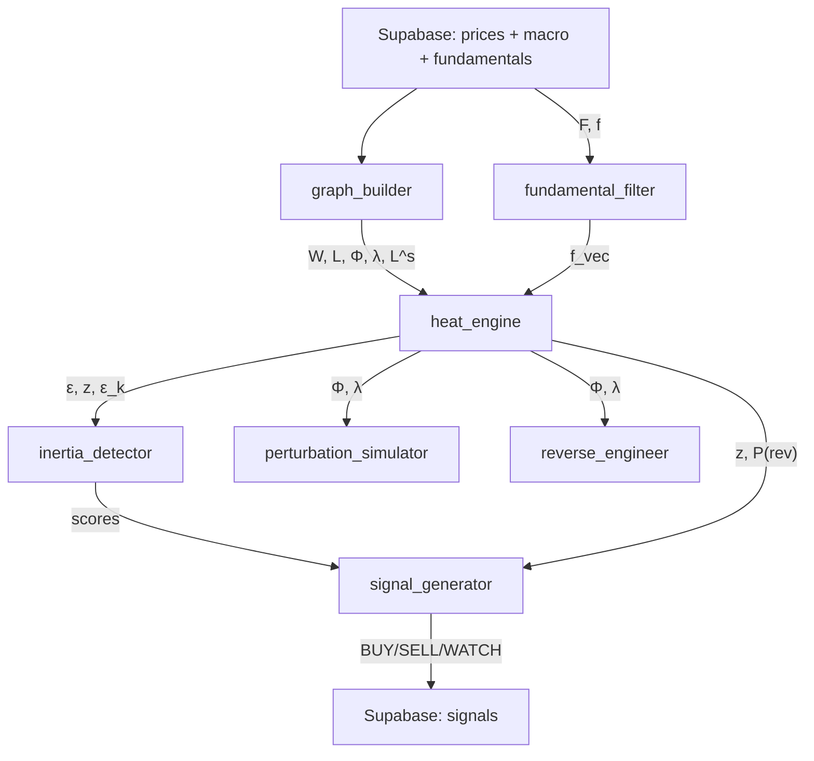
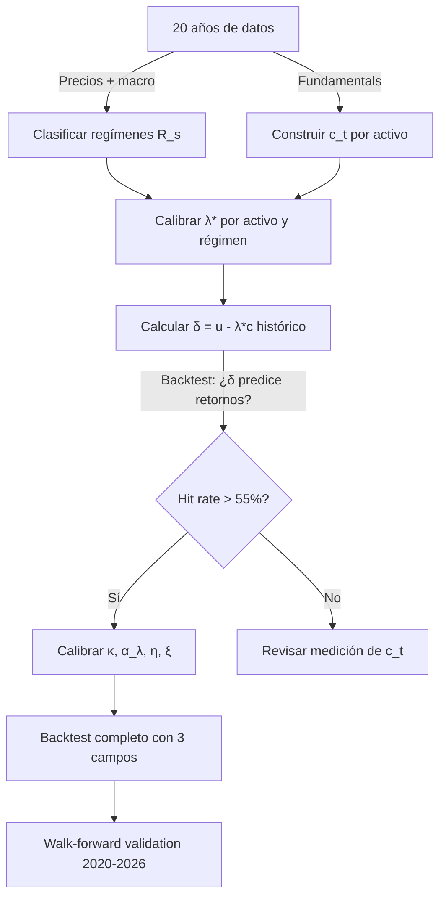

# Fundamento Matemático — GlobalMarketAnalyzer

## 1. El Modelo: Ornstein-Uhlenbeck sobre Grafo Fraccional

### 1.1 Variable de estado

Definimos la **temperatura** del activo $i$ como el retorno real acumulado:

$$u_i(t) = \sum_{\tau=1}^{t} \left[ r_i(\tau) - \pi(\tau) \right]$$

donde $r_i = \ln(P_i(t)/P_i(t-1))$ es el log-retorno y $\pi$ la inflación diaria (proxy: yield 2y / 252).

**¿Por qué "temperatura"?** Es una analogía termodinámica: capital acumulado ≡ energía térmica. Un activo "caliente" ha acumulado retornos por encima de la inflación; uno "frío" ha destruido valor real.

### 1.2 La ecuación O-U en grafo

El proceso estocástico que gobierna la dinámica es:

$$du = -\alpha \cdot L^s \cdot (u - u_{eq}) \cdot dt + f \cdot dt + \Sigma \cdot dW$$

| Término | Significado | Implementación |
|---|---|---|
| $\alpha$ | Tasa de reversión a la media | Calibrado por modo espectral |
| $L^s$ | Laplaciano fraccional del grafo | `graph_builder.fractional_laplacian` |
| $u_{eq}$ | Equilibrio (atraído por fundamentales) | `fundamental_filter.get_source_vector` |
| $f$ | Fuente/sumidero fundamental | $\gamma \cdot \tanh(F/F_0)$ |
| $\Sigma \cdot dW$ | Ruido estocástico | No modelado explícitamente (es el residuo) |

### 1.3 Solución analítica en espacio espectral

Descomponemos en los eigenvectores $\Phi$ del Laplaciano $L$:

$$L = \Phi \cdot \Lambda \cdot \Phi^T, \quad \Lambda = \text{diag}(\lambda_0, \lambda_1, ..., \lambda_{N-1})$$

Proyectamos al espacio espectral: $u_k = \Phi^T u$, $f_k = \Phi^T f$

En cada modo $k$ la solución es un O-U **escalar** independiente:

$$u_k(t+1) = u_k(t) \cdot e^{-\mu_k} + \frac{f_k}{\mu_k}(1 - e^{-\mu_k})$$

donde $\mu_k = \alpha_k \cdot \lambda_k^s$ es la **tasa de reversión del modo $k$**.

**Interpretación física:**
- $\lambda_k$ pequeño (modo lento) → $\mu_k$ pequeño → el modo persiste largo tiempo → **macro trend**
- $\lambda_k$ grande (modo rápido) → $\mu_k$ grande → equilibra rápido → **ruido/idiosincrático**
- $s < 1$ → fraccional → los modos lentos decaen más lento que en difusión normal → **memoria larga**

---

## 2. El Grafo: Multi-Capa con Cross-Lag

### 2.1 Construcción del grafo

Para cada par $(i,j)$ y cada lag $\ell \in [-15, +15]$ días:

$$\rho_{ij}(\ell) = \text{corr}(r_i(t), r_j(t+\ell))$$

Se elige el lag óptimo: $\ell^*_{ij} = \arg\max_\ell |\rho_{ij}(\ell)|$

La arista se crea si: $|\rho_{ij}(\ell^*)| > \theta$ (threshold = 0.25)

$$W_{ij} = \rho_{ij}(\ell^*_{ij}) \quad \text{si } |\rho| > \theta, \text{ else } 0$$

**Signo preservado**: $W_{ij} > 0$ = co-movimiento, $W_{ij} < 0$ = anti-correlación.

### 2.2 Multi-escala temporal

Se calcula $W$ para 3 ventanas: 20d (intraday contagion), 60d (sector rotation), 120d (macro cycles).

$$W_{eff} = w_1 \cdot W_{20d} + w_2 \cdot W_{60d} + w_3 \cdot W_{120d}$$

Los pesos $w_i$ son adaptativos: si VIX alto → más peso a escala corta (contagio rápido).

### 2.3 Vecinos de 2º y 3er orden

$$W^{(2)} = W \cdot W, \quad W^{(3)} = W^{(2)} \cdot W$$

> [!CAUTION]
> **Bug actual**: el código usa $|W| \cdot |W|$ (pierde signo) en vez de $W \cdot W$. Pendiente de fix en Fase 1.

**Interpretación**: Si cobre (FCX) → industriales (CAT) y CAT → materiales (XLB), entonces FCX ↝ XLB es un path de 2º orden. $W^{(2)}$ captura esto.

$$W_{total} = W + \beta_2 \cdot \bar{W}^{(2)} + \beta_3 \cdot \bar{W}^{(3)}$$

con $\beta_2 = 0.15$, $\beta_3 = 0.05$, y $\bar{W}^{(k)} = W^{(k)} / \max(W^{(k)})$ (normalizado).

### 2.4 Laplaciano con signo

$$L = D - W, \quad D_{ii} = \sum_j |W_{ij}|$$

El Laplaciano **con signo** difiere del clásico: los eigenvalores no son necesariamente ≥0 si hay suficientes aristas negativas. `np.maximum(λ, 0)` fuerza estabilidad.

### 2.5 Laplaciano fraccional

$$L^s = \Phi \cdot \Lambda^s \cdot \Phi^T, \quad \Lambda^s = \text{diag}(\lambda_0^s, ..., \lambda_{N-1}^s)$$

El parámetro $s \in (0, 1]$ controla la **no-localidad**:

$$s(t) = s_0 - c_1 \cdot \text{VIX}_{norm} - c_2 \cdot \text{spread} - c_3 \cdot \text{credit} - c_4 \cdot \text{credit\_\Delta} - c_5 \cdot \text{rate\_mom} - c_6 \cdot \text{copper} - c_7 \cdot \text{oil}$$

This heuristic s is used as the **prior attractor** for a UKF (Unscented Kalman Filter, P3.1) that tracks s through regime transitions using prediction error feedback:

$$s_{UKF}(t) = \text{UKF}(s_{heuristic}(t), \varepsilon_{pred}(t))$$

The UKF uses Merwe scaled sigma points (3 points for 1D state) and drifts toward the heuristic s while incorporating actual prediction errors to refine the estimate.

| Coefficient | Value | Signal |
|---|---|---|
| $c_1$ (VIX) | 0.20 | Implied volatility |
| $c_2$ (DXY) | 0.15 | Dollar strength |
| $c_3$ (spread) | 0.15 | Yield curve |
| $c_4$ (credit) | 0.15 | Credit spread level |
| $c_5$ (credit Δ) | 0.20 | Credit spread widening speed (P2.2) |
| $c_6$ (rate mom) | 0.15 | CB rate hiking momentum (P2.1) |
| $c_7$ (copper) | 0.10 | Industrial health |
| $c_8$ (oil) | 0.05 | Energy shock |

| $s$ | Régimen | Significado |
|---|---|---|
| $s \approx 1$ | Calma | Difusión local, correlaciones normales |
| $s \approx 0.5$ | Stress | No-local, contagio a distancia (Lévy flights) |
| $s \approx 0.2$ | Crisis | Todo correlacionado, un shock afecta a todos |

---

## 3. El Source Term: Fundamentales

### 3.1 Score fundamental

$$F_i = w_1 \cdot \text{FCF\_yield}_i + w_2 \cdot (\text{ROIC}_i - \text{WACC}) + w_3 \cdot (g_i - \pi) + w_4 \cdot Q_i$$

| Componente | Peso | Qué mide |
|---|---|---|
| FCF yield | 0.35 | Cash libre / market cap |
| ROIC excess | 0.25 | Retorno sobre capital - coste |
| Growth real | 0.25 | Crecimiento de revenue - inflación |
| Quality | 0.15 | Solvencia (debt/equity, current ratio) |

### 3.2 Source term

$$f_i = \gamma \cdot \tanh(F_i / F_0)$$

$F_0 = \text{mediana}(|F|)$ normaliza. $\gamma = 0.01$ es la tasa diaria máxima.

- $F \gg 0 \Rightarrow f \approx +\gamma$ → fuente de calor (crea valor)
- $F \ll 0 \Rightarrow f \approx -\gamma$ → sumidero (destruye valor)
- ETFs, commodities → $f = 0$ (neutros)

---

## 4. Residuos y Z-Scores

### 4.1 Residuo

$$\varepsilon_i(t) = u_i^{real}(t) - u_i^{pred}(t)$$

En espacio espectral: $\varepsilon_k(t) = u_k^{real}(t) - u_k^{pred}(t)$

### 4.2 Z-score rolling

$$z_i(t) = \frac{\varepsilon_i(t)}{\sigma_{\varepsilon_i}^{(20)}(t)}$$

donde $\sigma^{(20)}$ es desviación estándar rolling de 20 días.

**Interpretación**: $z > 0$ → activo "caliente" (por encima del equilibrio O-U), $z < 0$ → "frío".

---

## 5. Probabilidades Analíticas

Para el proceso O-U, la distribución condicional es Gaussiana:

$$u_i(t+h) \sim \mathcal{N}\left(\varepsilon_i(t) \cdot e^{-\mu_{eff} \cdot h}, \quad \frac{\sigma_i^2}{2\mu_{eff}}(1 - e^{-2\mu_{eff} \cdot h})\right)$$

donde:

$$\mu_{eff,i} = \sum_k \phi_{ki}^2 \cdot \mu_k = \sum_k \phi_{ki}^2 \cdot \alpha_k \cdot \lambda_k^s$$

**Probabilidad de reversión**: $P(\text{rev}) = P(|\varepsilon(t+h)| < |\varepsilon(t)|)$

**Half-life**: $t_{1/2} = \ln(2) / \mu_{eff}$

---

## 6. Inercia — 5 Componentes

### 6.1 Espacio de fases $(u_i, \dot{u}_i)$

La trayectoria en el plano posición-velocidad revela:
- **Espiral convergente** → reverting al equilibrio
- **Espiral divergente** → burbuja o tendencia acelerante
- **Ciclo cerrado** → trading range
- Radio $r(t) = \sqrt{u_i^2 + \dot{u}_i^2}$, y $dr/dt$ clasifica el estado

### 6.2 Masa efectiva

$$M_{eff,i} = \frac{1}{\sigma_{vol,i}} \cdot D_{ii} \cdot (1 + |\phi_{Fiedler,i}|)$$

Alta masa → señal más significativa (AAPL z=2 pesa más que un penny stock z=2).

### 6.3 Momento angular espectral

$$L_k(t) = u_k(t) \cdot \dot{u}_k(t)$$

$L_k > 0$ → capital rotando en una dirección. $|dL_k/dt|$ → torque.

### 6.4 Flujo de energía

$$E_k = \frac{1}{2}\left(u_k^2 + \frac{\dot{u}_k^2}{\lambda_k^s}\right), \quad \frac{dE_k}{dt} > 0 \Rightarrow \text{modo } k \text{ gana capital}$$

### 6.5 Histéresis

$$H_i = \frac{\langle|\varepsilon_i| \,|\, r_i > 0\rangle}{\langle|\varepsilon_i| \,|\, r_i < 0\rangle}$$

$H > 1$ → más fácil subir que bajar. $H < 1$ → más fácil bajar.

---

## 7. Ingeniería Inversa — Sismología

Dado un vector de retornos anómalos $r(t_0)$ el día del evento:

### 7.1 Firma espectral

$$\hat{r}_k = \Phi^T \cdot r(t_0), \quad k = 0, ..., N-1$$

### 7.2 Epicentro

$$i^* = \arg\max_i \frac{|r_i(t_0)|}{\sigma_i}$$

### 7.3 Similitud entre eventos

$$\text{sim}(A, B) = \frac{\hat{r}_A \cdot \hat{r}_B}{|\hat{r}_A| \cdot |\hat{r}_B|}$$

(Cosine similarity en espacio espectral.)

---

## 8. Flujo del Pipeline



---

## 9. Advección — Flujos de Capital

### 9.1 Ecuación completa (actual)

$$\frac{\partial u}{\partial t} = -\alpha \cdot L^s \cdot u + v(t) + f(t)$$

El término **v(t)** es la velocidad macro — hacia dónde fluye el capital:

$$v_i(t) = \sum_j \beta_{ij}(t) \cdot \Delta M_j(t) + \text{injection}(t)$$

| Componente | Fórmula | Significado |
|---|---|---|
| $\beta_{ij}$ | Regresión rolling 120d de $r_i$ vs $\Delta M_j$ | Sensibilidad del activo i al macro j |
| $\Delta M_j$ | Z-change 20d de VIX, DXY, yield, copper, oil | Velocidad de cambio macro |
| injection(t) | $\overline{r}(t)$ suavizado (EMA 20d) | Capital neto entrando/saliendo del sistema |

### 9.2 Decontaminación de W

Antes de construir el grafo, se elimina el factor de mercado:

$$r_i^{resid}(t) = r_i(t) - \beta_i^{mkt} \cdot \bar{r}(t)$$

Las correlaciones se calculan sobre $r^{resid}$, capturando relaciones reales (sustitución, cadena de suministro) sin co-movimiento espurio.

### 9.3 Capital NO se conserva

> [!IMPORTANT]
> A diferencia de la ecuación del calor clásica, el mercado financiero es un **sistema abierto**. El capital se crea (QE, earnings, inversión) y se destruye (QT, defaults, quiebras). El modo $k=0$ ($\lambda_0=0$) NO es conservación de capital — es la tendencia neta del sistema.

---

## 10. El Modelo de Agua sobre Paisaje: Dinero, Capital, y Precio

### 10.1 Las tres cosas que no son lo mismo

En los mercados financieros se confunden constantemente tres magnitudes que son radicalmente distintas:

**Dinero ($m$)** — El agua. Un medio de intercambio que fluye entre personas. Cuando compras acciones de AAPL, tu dinero va al vendedor. Apple no recibe nada. El dinero es fungible (un dólar es igual a otro), se conserva en cada transacción (tú pierdes $150, el vendedor los gana), pero NO se conserva globalmente: los bancos centrales lo crean (QE) y destruyen (QT).

**Capital ($K$)** — El terreno. La capacidad productiva real de cada empresa: las fábricas de TSMC, las patentes de Apple, los ingenieros de NVIDIA, la red logística de Amazon. El capital NO se mueve cuando alguien compra o vende acciones. Se crea lentamente (inversión en I+D, construcción de fábricas, contratación) y se destruye lentamente (depreciación, obsolescencia, quiebra). Es lo que realmente **produce** valor.

**Precio ($u$)** — La profundidad del agua. Es lo que observamos en el mercado. No es ni dinero ni capital: es cuánto dinero ha decidido el mercado asignar a cada unidad de capital. Si hay mucha agua (dinero) sobre un terreno bajo (poco capital productivo), el precio es alto pero vacío: **burbuja**. Si hay poca agua sobre terreno alto, el precio es bajo pero sustancioso: **oportunidad**.

### 10.2 La analogía del paisaje

Imaginemos un terreno con montañas y valles. El agua (dinero) fluye sobre este terreno:

```
     DINERO (agua)                    CAPITAL (terreno)
     ~~~~~~~~~~~~                     ▓▓▓▓▓▓▓▓▓▓▓▓▓▓▓
    ~~~~~~~~~~~~~~                   ▓▓▓▓▓▓▓▓▓▓▓▓▓▓▓▓▓▓
   ~~~~~~~~~~~~~~~~                 ▓▓▓ NVDA ▓▓▓▓▓▓▓▓▓▓▓
  ~~AAPL~~~~~NVDA~~~~              ▓▓▓▓▓▓▓▓▓▓▓▓▓▓▓▓▓▓▓▓▓▓
  ~~~~~~~~~~~~~~~~~~~    ~~       ▓▓▓▓▓▓▓▓▓▓▓▓▓▓▓▓  ▓▓▓▓▓▓
  ~~~~~~~~~~~~~~~~~~~ ~~SMCI~    ▓▓ AAPL ▓▓▓▓▓▓▓▓    ▓▓▓▓▓
  ~~~~~~~~~~~~~~~~~~~~~~~~~~~   ▓▓▓▓▓▓▓▓▓▓▓▓▓▓▓▓      ▓SMCI
  ▓▓▓▓▓▓▓▓▓▓▓▓▓▓▓▓▓▓▓▓▓▓▓▓▓▓▓▓▓▓▓▓▓▓▓▓▓▓▓▓▓▓▓▓▓▓▓▓▓▓▓▓▓▓

  Profundidad λ = agua/terreno = dinero asignado / capital real
  AAPL: λ moderado (agua proporcional al terreno) → bien valorada
  NVDA: λ alto (mucha agua sobre terreno grande) → ¿burbuja o justificado?
  SMCI: λ extremo (bastante agua, poco terreno) → probable burbuja
```

| Concepto físico | Concepto financiero | Variable | Fluye por el grafo? |
|---|---|---|---|
| **Agua** | Dinero del inversor | $m_i(t)$ | **SÍ** — es lo que se redistribuye al comprar/vender |
| **Terreno** | Capital productivo real | $K_i(t)$ | **NO** — fijo en cada empresa, cambia lento |
| **Profundidad** | Múltiplo de valoración | $\lambda_i = m_i / K_i$ | Derivado de los otros dos |
| **Nivel observable** | Precio de la acción | $u_i = \lambda_i \cdot K_i$ | Lo que vemos en Bloomberg |

### 10.3 Las ecuaciones

#### Ecuación del dinero (el fluido que fluye)

$$\frac{\partial m_i}{\partial t} = -\alpha_m \cdot L \cdot m_i + v_i(t) + \text{QE}(t)$$

El dinero se redistribuye entre activos por el Laplaciano del grafo (difusión: dinero fluye de donde hay mucho a donde hay poco, por arbitraje). La advección $v(t)$ captura flujos macro direccionales (flight to safety, risk-on rotation). QE/QT inyecta o retira dinero del sistema entero.

> [!IMPORTANT]
> El dinero **se conserva** en cada transacción individual (compra = venta), pero **NO se conserva** globalmente: QE lo crea, QT lo destruye, y los defaults lo evaporan.

#### Ecuación del capital (el terreno que cambia lento)

$$\frac{\partial K_i}{\partial t} = g_i(t)$$

El capital no tiene difusión ni convección — no se mueve entre empresas por el grafo. Las fábricas de Apple no "fluyen" a Microsoft. $g_i(t)$ captura la creación y destrucción local:

$$g_i(t) = \underbrace{\text{CAPEX}_i + \text{I+D}_i}_{\text{inversión}} - \underbrace{\text{depreciación}_i}_{\text{desgaste}} + \underbrace{\text{FCF}_i \cdot \mathbb{1}_{\text{ROIC} > \text{WACC}}}_{\text{valor económico añadido}}$$

| Mecanismo | $g_i$ | Ejemplo |
|---|---|---|
| Apple invierte en R&D para el Vision Pro | $g > 0$ | Capital intelectual creado |
| TSMC construye fábrica de 3nm en Arizona | $g > 0$ | Capital físico creado |
| El film fotográfico de Kodak se vuelve inútil | $g \ll 0$ | Capital destruido por obsolescencia |
| Lehman quiebra, activos liquidados | $g = -K$ | Capital total destruido |
| Fed hace QE de $4T | $g_{sistema} > 0$ | No crea capital real, pero infla $m$ |

#### Precio observable

$$u_i(t) = \lambda_i(t) \cdot K_i(t) = \frac{m_i(t)}{K_i(t)} \cdot K_i(t) = m_i(t)$$

> [!NOTE]
> Observación sorprendente: el precio de un activo es simplemente **cuánto dinero tiene asignado**. Un activo "caro" es uno que tiene mucho dinero apuntándole. Un activo "barato" tiene poco dinero asignado relativo a su capital productivo. El trading es reasignar dinero entre activos.

### 10.4 La señal de trading

$$\delta_i(t) = \lambda_i(t) - \lambda_{eq}(s(t))$$

Donde $\lambda_{eq}(s)$ es el múltiplo de equilibrio para el régimen actual:

$$\lambda_i(t) = \frac{u_i(t)}{K_i(t)} \quad \text{(precio / capital productivo)}$$

- $\delta > 0$: hay MÁS dinero asignado a este activo del normal para este régimen → **sobrevalorado**
- $\delta < 0$: hay MENOS dinero del normal → **infravalorado**
- Señal fuerte: $\delta < 0$ Y $v_i > 0$ → infravalorado Y el dinero está llegando → **compra**
- Señal de huida: $\delta > 0$ Y $v_i < 0$ → sobrevalorado Y el dinero se va → **venta**

### 10.5 Ejemplo: NVDA en 2023-2024

```
2022 Q4: K_NVDA = alto (GPUs, CUDA, datacenter). u_NVDA = $150
         λ = $150 / K ≈ 15x → normal para tech
         δ = 15 - 20 = -5 → infravalorado

2023 Q2: ChatGPT explota. v_NVDA >> 0 (dinero fluye HACIA NVDA)
         K no cambia aún (mismas fábricas, misma IP)
         u_NVDA = $400. λ = $400/K ≈ 40x
         δ = 40 - 20 = +20 → sobrevalorado?

2023 Q4: NVDA reporta FCF $11B (antes $3B). K SUBE (capital real creó)
         u_NVDA = $500. Pero K subió → λ = $500/K_nuevo ≈ 30x
         δ = 30 - 25 = +5 → ligeramente caro, pero el terreno subió

2024 Q2: Más dinero llega pero K sigue creciendo rápido
         u_NVDA = $900. K sube más → λ ≈ 35x
         δ = 35 - 30 = +5 → el modelo diría: caro pero justificado
         Señal: HOLD (no vender aún, el capital crece)
```

La clave: la burbuja NO es que el precio suba. Es que el precio suba **sin que el capital productivo crezca proporcionalmente**. NVDA creó capital real (FCF ×4). SMCI subió 1000% sin crear capital proporcional → burbuja real.

### 10.6 Conservación y no-conservación

| Magnitud | ¿Conservada en trades? | ¿Conservada globalmente? |
|---|---|---|
| **Dinero** (m) | ✅ Sí: compra = venta | ❌ No: QE crea, QT destruye |
| **Capital** (K) | ✅ Sí: no se mueve en trades | ❌ No: inversión crea, obsolescencia destruye |
| **Precio** (u = m) | ✅ En cada transacción | ❌ Globalmente puede subir todo (inflación) o bajar todo (deflación) |
| **λ = m/K** | ❌ No: cambia con cada trade | ❌ Puede expandirse (hype) o contraerse (crisis) colectivamente |

---

## 11. Parámetros a Calibrar Históricamente

### 11.1 Lista completa de parámetros

| Parámetro | Ecuación | Calibración | Datos necesarios |
|---|---|---|---|
| $\alpha$ | Difusión de u | OOS minimization (ya implementado) | Precios 20y |
| $s(t)$ | Fracionalidad del Laplaciano | Z-scores de macro (implementado) | VIX, DXY, spreads |
| $\kappa$ | Acoplamiento u↔λc | Regresión $\Delta u$ vs $(\lambda c - u)$ | Fundamentals + precios |
| $\lambda^*_i(R)$ | Múltiplo por activo y régimen | OLS condicionado (Sec 10.5) | 20y precios + fundamentals |
| $\alpha_\lambda$ | Difusión de múltiplos | Autocorrelación de PE ratios sectoriales | 20y PE ratios |
| $\eta$ | Sensibilidad de λ a earnings | Event study en earnings surprises | Earnings calendar |
| $\xi$ | Reflexividad (momentum→λ) | Regresión $\Delta \lambda$ vs $\nabla u$ | 20y precios |
| $\beta_{ij}$ | Sensibilidad macro | Rolling regression 120d (implementado) | 20y precios + macro |
| $\tilde{W}$ | Grafo dirigido para λ | Causalidad de Granger + capitalización | 20y retornos |

### 11.2 Estrategia de calibración



**Walk-forward**: calibrar en 2005-2019, testear en 2020-2026 (out-of-sample incluye COVID, AI hype, rate hikes).

### 11.3 Riesgo de sobreajuste

Con 9+ parámetros y 20 años de datos:
- **Grados de libertad**: ~5,000 días × 100 activos = 500,000 observaciones → suficiente
- **Pero**: los regímenes son pocos (3-4 crisis, 2-3 hype periods) → los parámetros condicionados por régimen tienen N pequeño
- **Mitigación**: regularización (ya en α), cross-validation temporal, penalizar complejidad (BIC/AIC)

---

## 12. Roadmap de Implementación

| Prioridad | Tarea | Estado |
|---|---|---|
| ✅ | Cargar 20y de datos (precios + macro + fundamentals) | Completado |
| ✅ | P0: Expansión del grafo (148 tickers, 10 países, 4 zonas) | PR #3 |
| ✅ | P1: Trading strategy (costes reales, Z adaptivo, hard stop) | PR #5 |
| ✅ | P2.2: Credit spread delta (early warning) | PR #7 |
| ✅ | P2.3: Earnings whisper + analyst target gap | PR #8 |
| ✅ | P2.1: CB rate momentum | PR #9 |
| ✅ | P3.1: UKF for s (sigma points, regime tracking) | PR #12 |
| ✅ | P3.2: Persist Kalman state (Supabase JSONB) | PR #12 |
| ✅ | P4.1: Crisis backtest (COVID, 2022, Volmageddon) | PR #TBD |
| ✅ | P4.2: Cross-validation (3-fold train/test, overfitting detection) | PR #TBD |
| ✅ | P4.3: Paper trading (daily signals → Supabase, --review scoring) | PR #TBD |
| 🟢 | Calibrar $\lambda^*(R)$ por régimen con OLS | Pendiente |
| 🟢 | Grafo dirigido $\tilde{W}$ con Granger causality | Pendiente |
| 🟢 | Eigenvalores complejos → ciclos sectoriales | Investigación |
