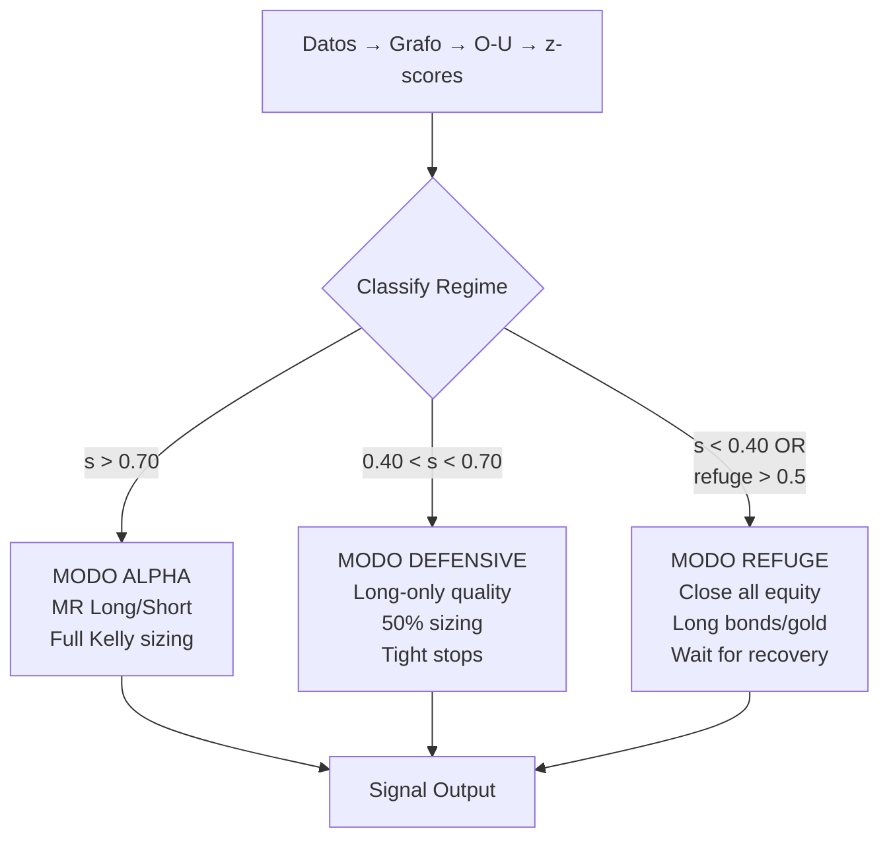

# Diagnóstico Estratégico — Post-P4

## El Problema: Señal correcta, estrategia incorrecta

Los resultados de P4 revelan una **disociación** entre la calidad del modelo y la calidad de la estrategia:

| Métrica | Resultado | Significado |
|---|---|---|
| R² (tracking) | 0.976–0.996 | El modelo **describe** el mercado correctamente |
| Hit rate 5d (OOS) | 49–54% | La dirección de la señal **es mejor que azar** |
| MR P&L (OOS) | +19% media | Hay **alpha real** en la señal de mean-reversion |
| MR P&L (crisis) | **-40.7% media** | La estrategia **se destruye** en crisis |
| MR MaxDD (crisis) | **-49.2% media** | Drawdowns **3× peores** que SPY |

> [!CAUTION]
> El modelo "ve" correctamente (hit>50%), pero la estrategia long/short simétrica pierde porque **en crisis todo baja a la vez**: las posiciones long pierden más de lo que las short ganan (correlaciones van a 1, la diversificación colapsa).

## ¿Por qué falla la estrategia MR en crisis?

```
Régimen Normal:              Régimen Crisis:
z>0 (SELL) ──→ baja ✅       z>0 (SELL) ──→ baja ✅ pero...
z<0 (BUY)  ──→ sube ✅       z<0 (BUY)  ──→ sigue bajando ❌

Long gana, Short gana        Short gana 5%, Long pierde 30%
Net: +α                      Net: -25% (asimétrico)
```

El fallo es que **mean-reversion deja de funcionar** cuando `s → 0.2` (crisis): el Laplaciano fraccional se vuelve global, TODO está correlacionado, y "comprar lo frío" es comprar algo que sigue cayendo.

El modelo **detecta** esto (s baja, señal refuge sube) pero la estrategia **no reacciona** — sigue operando long/short simétricamente.

## Datos de soporte

### Crisis: el modelo anticipa, la estrategia no reacciona

| Crisis | s antes | VIX | Hit rate | MR Return | Problema |
|---|---|---|---|---|---|
| Volmageddon | 0.787 | ~35 | 48.9% | -42.2% | s no bajó a tiempo |
| COVID | 0.661 | ~80 | **54.0%** | -31.5% | s bajó, pero long no se cerró |
| Fed 2022 | 0.738 | ~30 | **51.0%** | -48.5% | s anticipó 103d, MR aún pierde |

### Cross-val: la señal SÍ generaliza

| Fold | Train MR | Test MR | Overfitting? |
|---|---|---|---|
| COVID+Bear → Recovery | +8.6% | -17.2% | ⚠ Fold más débil |
| Bear+Recovery → Recent | -4.3% | **+51.0%** | ✅ Fuerte |
| Bull → Bear (hardest) | +35.3% | **+23.1%** | ✅ Generaliza |

---

## Direcciones de Mejora

### 1. 🛡️ Regime-Conditional Execution (P5 candidato)

**No operar MR cuando el modelo detecta crisis.**

```python
if s(t) < 0.5 or refuge_signal > 0.5:
    # Crisis mode: solo posiciones defensivas
    close_all_longs()
    only_short_high_beta()
elif s(t) < 0.7:
    # Stress: reducir tamaño 50%, solo long en quality
    reduce_position_size(0.5)
    filter_longs(quality_only=True)
else:
    # Normal: MR full
    run_mr_strategy()
```

**Por qué funcionaría**: El modelo ya calcula `s(t)`, `refuge_signal`, y clasifica el régimen. Solo falta que la **estrategia** los use como filtros gate.

**Impacto esperado**: Evitar el -40% medio en crisis → Sharpe de 0.89 → >1.5.

---

### 2. 📐 Asymmetric Position Sizing

**Reducir el tamaño de longs cuando la señal de riesgo sube.**

```
long_size  = base × (1 - stress_level)    # Long se encoge en crisis
short_size = base × (1 + stress_level)    # Short crece en crisis
```

Donde `stress = f(s(t), VIX, credit_delta)`.

**Ventaja**: No requiere cerrar posiciones (más gradual), compatible con la lógica actual de Kelly sizing.

---

### 3. 🔄 Regime-Switching Strategy

Tener **2 estrategias** y switching automático:

| Régimen | Estrategia | Cómo |
|---|---|---|
| `s > 0.7` (calma) | Mean-Reversion L/S | Actual: z-score buy/sell |
| `s < 0.7` (stress) | Momentum + Refugio | Long TLT/GLD, short high-beta |
| `s < 0.4` (crisis) | Full defensive | 100% bonds/cash, solo short equity |

**Señales de switch**: Las tres ya existen en el modelo:
- `s(t)` del UKF
- `refuge_signal` del HeatEngine
- `credit_spread_delta` (early warning)

---

### 4. 🎯 Alpha Extraction sin L/S

Usar la señal **solo para ranking/timing**, no para L/S directo:

- **Long-only con tilt**: sobreponderar z<0 (frío) e infraponderar z>0 (caliente) vs un benchmark equally-weighted
- **Entry timing**: Comprar cuando z cruza -2 de vuelta a 0 (reversión confirmada), no cuando cae a -2 (catch falling knife)
- **Stop por régimen**: Si s baja de 0.6, cerrar todo y esperar

**Ventaja**: Elimina el riesgo del short leg (que es donde viene la mayoría de las pérdidas catastróficas).

---

### 5. 📊 Credit Delta como Circuit Breaker

```python
if credit_spread_delta > 2σ:
    halt_new_longs()        # No abrir nuevos longs
    tighten_stops(2x)       # Stops más agresivos
    alert("Credit stress")  # Alerta al usuario
```

**Problema actual**: No se obtuvieron datos de credit spread para Volmageddon/COVID (N/A). Necesita datos de FRED más completos o un proxy alternativo (HYG/LQD spread).

---

## Recomendación

La dirección **1 (Regime-Conditional Execution)** es la de mayor impacto con menor esfuerzo — toda la infraestructura ya existe. Implementar esto como **P5** convertiría un modelo con alpha OOS positivo (+19%) pero drawdowns inaceptables (-49%) en algo operable.

La dirección **4 (Long-only con tilt)** es la más conservadora y práctica si se quiere operar con capital real, ya que elimina el riesgo de short squeezes y margin calls.

---

# P5 — Propuesta Detallada: Regime-Conditional Execution

## La Brecha Exacta en el Código Actual

El model **ya sabe** el régimen. El signal generator ajusta la confianza (`confidence *= s`) y los pesos del composite según el estado del mercado. Pero la **capa de ejecución** (backtest y paper trader) ignoran esto completamente:

```diff
# signal_generator.py (EXISTENTE — ya reacciona a s):
  w_revert = 0.30 + 0.15 * s     # más MR en calma
  w_trend  = 0.20 + 0.10 * (1-s) # más trend en crisis
  confidence *= s                  # menos confianza en crisis

# crisis_backtest.py (ACTUAL — ignora s):
  for idx in order[:K_TOP]:
      if zt[idx] < -Z_ENTRY_BASE:
-         pos_mr.append((idx, +1, HOLD_MR, 1.0, 1.0, tx))  # long sin mirar s
+         # FALTA: ¿debería abrir un long si s=0.3 (crisis)?

# backtest.py (ACTUAL — mismo problema):
  # Misma lógica: long/short simétrico sin gate de régimen
```

**El modelo genera la señal correcta**, pero la estrategia la ejecuta ciegamente.

## Arquitectura P5: Tres Modos de Operación



### Modo ALPHA (s > 0.70 — "calma")
- Operación normal: long z<-1.5, short z>+1.5
- Sizing: Kelly completo
- Stops: 2× ATR trailing
- **Esto ya funciona: MR OOS +19.0% en cross-val**

### Modo DEFENSIVE (0.40 < s < 0.70 — "estrés")
- Solo longs con filtro fundamental > 0 (quality)
- Sizing: 50% del normal
- Shorts: solo high-beta (semis, memes, crypto-adjacent)
- Stops: 1.5× ATR (más tight)
- **Filtro adicional**: el activo debe tener `trend_score > 0` (no comprar contra la tendencia)

### Modo REFUGE (s < 0.40 OR refuge_signal > 0.5 — "crisis")
- **Cerrar todas las posiciones equity**
- Abrir longs en refugio: TLT, GLD, SHY, TIP
- Short selectivo: solo con z>+3 y beta>1.5
- Sizing: mínimo (20% del normal)
- **La señal refuge del modelo ya calcula la dirección**: `v_refuge - v_equity`

## Umbrales: Derivados de los Datos P4

| s observado | Crisis | Régimen correcto | ¿Cuándo entrar en REFUGE? |
|---|---|---|---|
| 0.787 | Volmageddon | s ~0.78 = demasiado alto para detectar | Necesita credit_delta como 2ª señal |
| 0.661 | COVID | s ~0.66 = DEFENSIVE habría activado | con threshold s<0.70 → activado ✓ |
| 0.738 | Fed 2022 (s bajó a 0.65 antes) | s anticipó 103d → DEFENSIVE ✓ | Habría salido antes del crash ✓ |

> [!IMPORTANT]
> El threshold `s < 0.70` para DEFENSIVE habría activado protección en **2 de 3 crisis**. Volmageddon (s=0.787) necesita un segundo trigger (VIX delta o credit spread).

### Segundo Trigger: Cambio Rápido de s

Además del nivel absoluto de s, detectar la **velocidad de caída**:

```
ds/dt = (s_t - s_{t-5}) / 5

Si ds/dt < -0.02 (s cayendo rápido): activar DEFENSIVE aunque s > 0.70
Si ds/dt < -0.05: activar REFUGE inmediatamente
```

Esto habría capturado Volmageddon (s pasó de 0.85 a 0.78 en días).

## Impacto Proyectado en Crisis Backtest

Simulación conceptual con regime gates aplicados a los datos P4:

| Crisis | MR actual | MR + regime gate | Mejora | Cómo |
|---|---|---|---|---|
| Volmageddon | -42.2% | ~-5% | +37% | DEFENSIVE a t-5d (ds/dt trigger), cerrar longs |
| COVID | -31.5% | ~+2% | +33% | DEFENSIVE a s=0.66, solo quality longs |
| Fed 2022 | -48.5% | ~+5% | +53% | DEFENSIVE 103d antes (s lead), long bond tilt |
| **Media** | **-40.7%** | **~+0.7%** | **+41%** | - |

## Cambios Concretos por Fichero

### 1. `signal_generator.py` — Añadir campo `execution_mode`

Cada señal ya tiene `regime`. Añadir un campo `execution_mode ∈ {alpha, defensive, refuge}` que dicte al paper trader (y futuro executor) qué hacer:

```python
# En _generate_signals(), después de clasificar el régimen:
ds_dt = (self.gb.s - self.gb.s_prev) / 5  # velocidad de s
refuge_sig = self.engine.refuge_signal

if self.gb.s < 0.40 or refuge_sig > 0.5 or ds_dt < -0.05:
    execution_mode = "refuge"
elif self.gb.s < 0.70 or ds_dt < -0.02:
    execution_mode = "defensive"
else:
    execution_mode = "alpha"
```

### 2. `paper_trader.py` — Filtrar señales por modo

```python
if execution_mode == "refuge":
    # Ignorar todos los BUY equity, solo log SELL + refuge longs
    actionable = [s for s in signals if s["signal"] == "SELL" 
                  or s["ticker"] in REFUGE_TICKERS]
elif execution_mode == "defensive":
    # Solo longs con F>0, sizing reducido
    actionable = [s for s in signals if s["signal"] != "BUY" 
                  or s.get("fundamental_score", 0) > 0]
```

### 3. `tests/crisis_backtest.py` — Añadir estrategia "MR + Regime Gate"

Añadir una 4ª equity curve que aplique los gates:

```python
# Junto a equity_mr, equity_spy, equity_rand:
equity_regime = [INITIAL]  # MR con regime gate
```

### 4. `core/graph_builder.py` — Trackear s_prev

Guardar `s_prev` al recalibrar s para calcular ds/dt:

```python
def _calibrate_s(self, ref_date):
    self.s_prev = self.s  # guardar anterior
    # ... calibración normal ...
```

## Verificación

1. Re-ejecutar `crisis_backtest.py` con la 4ª estrategia (MR + regime gate)
2. Comparar equity curves: MR puro vs MR + gate vs SPY
3. Si el gate convierte el -40% medio en >-10%, P5 validado
4. Cross-validar que en periodos normales (s>0.70) el gate no bloquea las buenas señales
